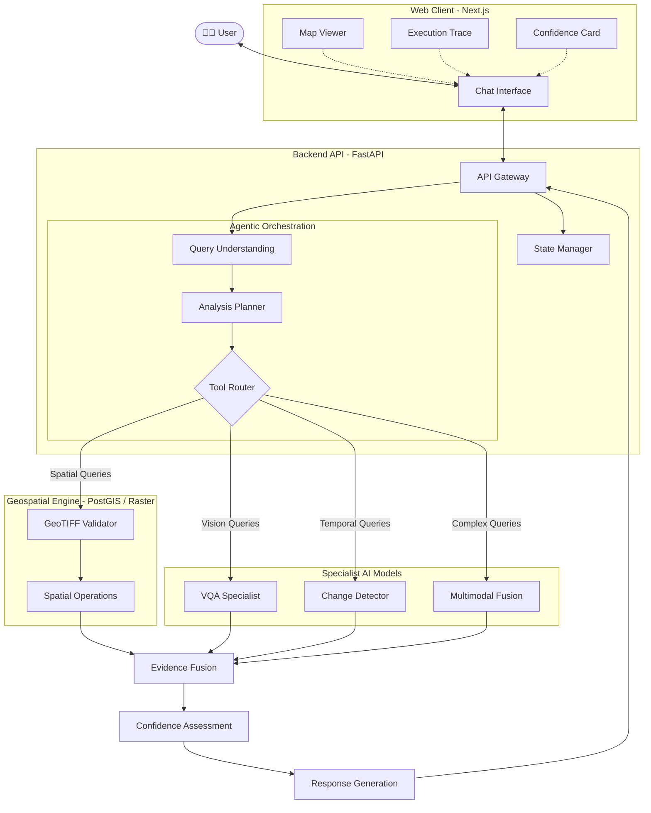

<div align="center">
  <h1>🛰️ SatQuery AI</h1>
  <p><strong>An Agentic Vision-Language Assistant for Multimodal Remote-Sensing Image Analysis through Natural-Language Queries.</strong></p>
  
  <p>
    
    
    
    
    
    
  </p>

  <p>
    <strong>Organization:</strong> Indian Space Research Organisation (ISRO) <br/>
    <strong>Hackathon:</strong> Smart India Hackathon 2026 (Problem Statement: SIH26167) <br/>
    <strong>Team:</strong> LIFTOFF
  </p>

  <p>
    SatQuery AI converts natural-language questions about satellite imagery into structured remote-sensing analysis workflows. It validates inputs, understands the requested task, routes the request to appropriate specialist models and geospatial tools, performs analysis, validates spatial evidence, and returns an interpretable result with visual evidence, confidence assessment, and execution trace.
  </p>

  <p>
    <a href="#project-overview">Overview</a> •
    <a href="#architecture--pipeline">Architecture</a> •
    <a href="#features--roadmap-status">Roadmap</a> •
    <a href="#getting-started">Getting Started</a> •
    <a href="#documentation">Documentation</a>
  </p>
</div>

---

## 🌍 Project Overview

### What is SatQuery AI?
SatQuery AI is an intelligent orchestration platform designed to democratize satellite image analysis. It acts as an agentic assistant that allows users to query complex multimodal remote sensing data using plain natural language, abstracting away the steep learning curve associated with traditional GIS software.

### Why does it exist and what problem does it solve?
Traditionally, extracting intelligence from satellite imagery requires expertise in remote sensing, GIS tools, and specific machine learning models. SatQuery AI solves this accessibility problem by bridging the gap between non-expert end-users and highly specialized spatial processing techniques. 

### Who is it for?
It is built for decision-makers, urban planners, environmental researchers, and emergency responders who need immediate, reliable geospatial intelligence without writing code or manually processing raw satellite feeds.

### What makes it different?
**Instead of making the user select the tool, SatQuery AI selects the analysis workflow for the user.**

Unlike standard chatbots that attempt to answer directly, SatQuery AI is NOT simply:

`User → LLM → Answer`

Instead, it enforces a rigorous, verifiable agentic workflow:

```text
User
 ↓
Natural Language Query
 ↓
Query Understanding
 ↓
Analysis Planning
 ↓
Model / Tool Selection
 ↓
Remote-Sensing Analysis
 ↓
GIS Verification
 ↓
Evidence Fusion
 ↓
Confidence Assessment
 ↓
Answer + Visual Evidence + Execution Trace
```

---

## ✨ Key Features

| Capability | Description | Status |
|------------|-------------|--------|
| Natural-language queries | Ask questions using natural language | 🚧 Planned |
| Single-image VQA | Question answering over satellite imagery | 🚧 Planned |
| Captioning / scene description | Generate image-level descriptions | 🚧 Planned |
| Text-guided grounding | Locate queried objects or regions | 🚧 Planned |
| Bi-temporal analysis | Compare imagery from two dates | 🚧 Planned |
| Change detection | Identify spatial changes | 🚧 Planned |
| Change VQA | Answer questions about temporal changes | 🚧 Planned |
| Optical analysis | Analyze optical/multispectral imagery | 🚧 Planned |
| SAR analysis | Analyze SAR imagery | 🚧 Planned |
| Optical + SAR fusion | Joint multimodal interpretation | 🚧 Planned |
| Agentic orchestration | Automatically select models/tools | 🚧 Planned |
| GIS validation | Spatial verification and processing | ✅ Implemented |
| Visual evidence | Masks, boxes, maps and overlays | 🚧 Planned |
| Confidence assessment | Evidence-based uncertainty indication | 🏗️ In Development |
| Execution trace | Show how the result was produced | 🏗️ In Development |

---

## 🏗️ System Architecture

SatQuery AI's architecture is built strictly on the principles of modularity and separation of concerns. It enforces a clean boundary between the ML models, GIS processing pipelines, and API services.



## 🚀 Features & Roadmap Status

To maintain engineering transparency, the following accurately reflects the current status of the repository, clearly distinguishing what is actively running versus what is planned or under research.

### ✅ IMPLEMENTED (Current Focus: Foundation)
The current development stage focuses strictly on the foundation, architecture, API contracts, and development environment.
- **Microservices Architecture:** Fully separated frontend and backend services that are independently deployable.
- **API Contracts:** Strictly typed communication layers (via Pydantic) ensuring robustness.
- **Dockerized Environment:** Complete local development setup via `docker-compose`.
- **GIS Engine Interface:** Foundational structures for GeoTIFF input validation and spatial operations.
- **AI Tool Interfaces:** Abstract classes and strict interfaces for future hot-swappable ML models.

### 🚧 PLANNED (Future Roadmap)
These features are part of the core roadmap but are intentionally not implemented in the current foundational phase to prevent over-engineering.
- **Phase 1:** GeoTIFF input validation and metadata extraction.
- **Phase 2:** Single-image Visual Question Answering (VQA) with spatial grounding.
- **Phase 3:** Bi-temporal change analysis for environmental and urban monitoring.
- **Phase 4:** Optical and SAR data fusion.
- **Phase 5:** Full Agentic Orchestration allowing dynamic model execution.
- **Phase 6:** Evaluation, optimization, and production cloud deployment.

### 🔬 RESEARCHED
- **VLM Architectures:** Evaluation of current Vision-Language Models for remote sensing.
- **Agentic Orchestration Patterns:** Research into query understanding and tool routing for spatial tasks.

### 🧪 EXPERIMENTAL
- **Complex Distributed Systems:** Testing orchestration scalability (Kubernetes).
- **Production Authentication:** Prototyping secure access for ISRO/enterprise standards.

---

## 💻 Getting Started

### Prerequisites
- Docker & Docker Compose
- Node.js (for local frontend development)
- Python 3.10+ (for local backend development)

### Local Development Setup

To spin up the foundational services, we recommend using Docker Compose:

```bash
# Clone the repository
git clone https://github.com/LIFTOFF/SatQuery-AI.git
cd SatQuery-AI

# Copy the environment template
cp .env.example .env

# Start the services
docker-compose up --build
```
This will initialize the backend API, GIS processing nodes, and the frontend client. 

---

## 📚 Documentation

The `docs/` directory contains in-depth information regarding the architectural decisions and system design:

- **[System Architecture](docs/architecture/system.md):** High-level overview of services and communication.
- **[Backend Architecture](docs/architecture/backend.md):** Details on the Python API, GIS engine, and AI model integration.
- **[Frontend Architecture](docs/architecture/frontend.md):** Details on the React/Vite client interface.
- **[Local Development Setup](docs/development/setup.md):** How to get the project running.
- **[API Contracts & Conventions](docs/api/api-contract.md):** Standards for requests, responses, and error handling.

---

<div align="center">
  <sub>Built for the Smart India Hackathon 2026 by Team LIFTOFF</sub>
</div>
