<div align="center">
  <h1>🛰️ SatQuery AI</h1>
  <p><strong>An Agentic Vision-Language Assistant for Multimodal Remote-Sensing Image Analysis through Natural-Language Queries.</strong></p>

  <p>
    
    
    
    
    
    
    
    
    
  </p>

  <p>
    <strong>Organization:</strong> Indian Space Research Organisation (ISRO)<br/>
    <strong>Hackathon:</strong> Smart India Hackathon 2026 · Problem Statement SIH26167<br/>
    <strong>Team:</strong> LIFTOFF
  </p>

  <p>
    Welcome to SatQuery AI! We're building an agentic vision-language assistant designed to make satellite image analysis accessible to everyone. Traditionally, diving into geospatial data required deep expertise in GIS and remote sensing. We're breaking that down, allowing decision-makers, urban planners, and disaster-response teams to get reliable, visual intelligence using plain natural language.
  </p>
</div>

---

## Table of Contents

1.  [Project Overview](#1-project-overview)
2.  [Key Features](#2-key-features)
3.  [System Architecture](#3-system-architecture)
4.  [Product Workflow](#4-product-workflow)
5.  [Image Analysis Workflows](#5-image-analysis-workflows)
6.  [Evidence-First Intelligence](#6-evidence-first-intelligence)
7.  [Supported Inputs](#7-supported-inputs)
8.  [Technology Stack](#8-technology-stack)
9.  [Repository Structure](#9-repository-structure)
10. [Backend Architecture](#10-backend-architecture)
11. [Frontend Architecture](#11-frontend-architecture)
12. [API Architecture](#12-api-architecture)
13. [Analysis Job Lifecycle](#13-analysis-job-lifecycle)
14. [Execution Trace](#14-execution-trace)
15. [Confidence & Uncertainty](#15-confidence--uncertainty)
16. [Geospatial Processing](#16-geospatial-processing)
17. [Model Registry](#17-model-registry)
18. [Tool Registry](#18-tool-registry)
19. [Local Development Setup](#19-local-development-setup)
20. [Environment Variables](#20-environment-variables)
21. [Development Workflow](#21-development-workflow)
22. [Testing](#22-testing)
23. [Evaluation Plan](#23-evaluation-plan)
24. [Datasets & Research Foundations](#24-datasets--research-foundations)
25. [SIH26167 Alignment](#25-sih26167-alignment)
26. [Development Roadmap](#26-development-roadmap)
27. [Security](#27-security)
28. [Limitations](#28-limitations)
29. [Responsible AI](#29-responsible-ai)
30. [Performance & Scalability](#30-performance--scalability)
31. [Screenshots & Visual Workflow](#31-screenshots--visual-workflow)
32. [Conceptual Result Interface](#32-conceptual-result-interface)
33. [Contributing](#33-contributing)
34. [Code Quality Standards](#34-code-quality-standards)
35. [License](#35-license)
36. [Team](#36-team)
37. [References](#37-references)

---

## 1. Project Overview

### What is SatQuery AI?

SatQuery AI is an intelligent orchestration platform designed to democratize satellite image analysis. It acts as an agentic assistant that allows users to query complex multimodal remote-sensing data using plain natural language, abstracting away the steep learning curve associated with traditional GIS software.

### Why does it exist?

Extracting intelligence from satellite imagery traditionally requires expertise in remote sensing, GIS tools, and domain-specific machine learning models. SatQuery AI bridges the gap between non-expert end-users and highly specialized spatial processing techniques.

### Who is it for?

Decision-makers, urban planners, environmental researchers, disaster-response teams, and anyone who needs immediate, reliable geospatial intelligence without writing code or manually processing raw satellite feeds.

### What makes it different?

**Instead of making the user select the tool, SatQuery AI selects the analysis workflow for the user.**

SatQuery AI is NOT simply:

`User → LLM → Answer`

It enforces a rigorous, verifiable agentic workflow:

```text
User
 ↓
Natural Language Query
 ↓
Query Understanding
 ↓
Analysis Planning
 ↓
Model / Tool Selection
 ↓
Remote-Sensing Analysis
 ↓
GIS Verification
 ↓
Evidence Fusion
 ↓
Confidence Assessment
 ↓
Answer + Visual Evidence + Execution Trace
```

---

## 2. Key Features

| Capability | Description | Status |
|---|---|---|
| Natural-language queries | Ask questions about satellite imagery in plain text | 🚧 Planned |
| Single-image VQA | Question answering over a single satellite scene | 🚧 Planned |
| Captioning / scene description | Generate image-level textual descriptions | 🚧 Planned |
| Text-guided grounding | Locate queried objects or regions spatially | 🚧 Planned |
| Bi-temporal analysis | Compare imagery from two acquisition dates | 🚧 Planned |
| Change detection | Identify and map spatial changes | 🚧 Planned |
| Change VQA | Answer questions about temporal changes | 🚧 Planned |
| Optical analysis | Analyze optical / multispectral imagery | 🚧 Planned |
| SAR analysis | Analyze Synthetic Aperture Radar imagery | 🚧 Planned |
| Optical + SAR fusion | Joint multimodal interpretation | 🚧 Planned |
| Agentic orchestration | Automatically select models and tools per query | 🚧 Planned |
| GIS validation | Spatial verification and geospatial processing | ✅ Implemented |
| Visual evidence | Masks, bounding boxes, maps, and overlays | 🚧 Planned |
| Confidence assessment | Evidence-based uncertainty indication | 🏗️ In Development |
| Execution trace | Show how the result was produced | 🏗️ In Development |

---

## 3. System Architecture

The architecture enforces strict separation between ML models, GIS processing, and API services.

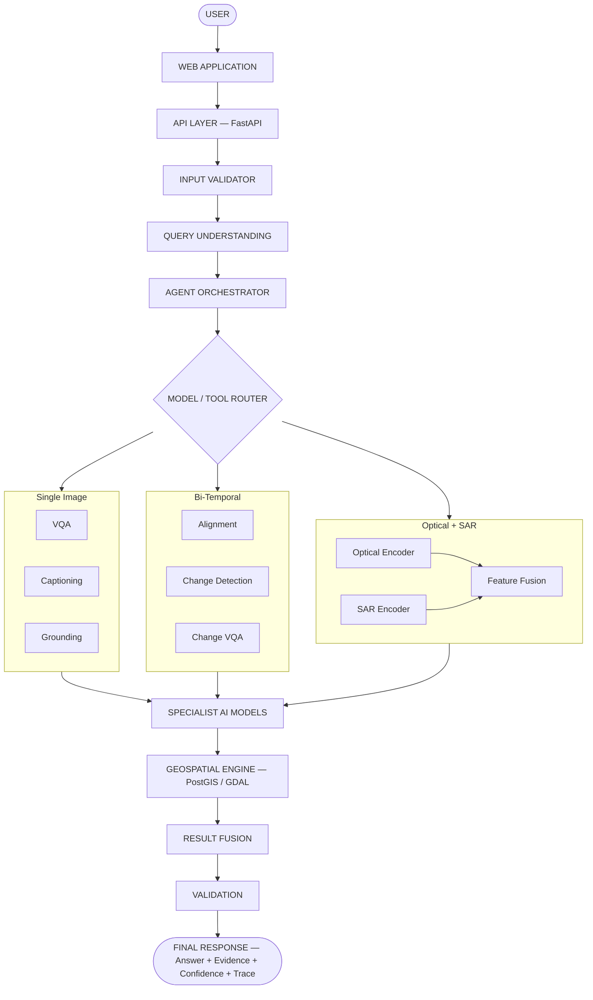

---

## 4. Product Workflow

`QUERY → UNDERSTAND → PLAN → ANALYSE → VERIFY → EXPLAIN`

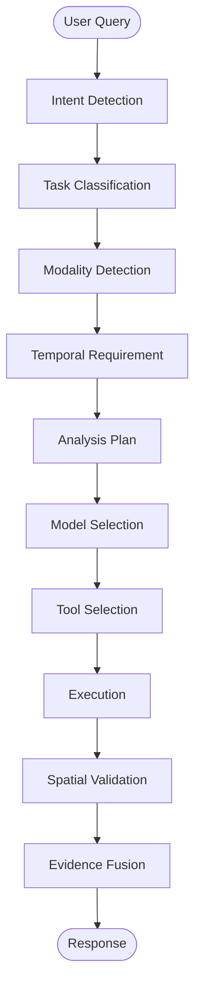

| Stage | Description |
|---|---|
| **QUERY** | User submits a text question and one or more images. |
| **UNDERSTAND** | Detects intent, required tasks, modality, and temporal scope. |
| **PLAN** | Generates an ordered analysis execution sequence. |
| **ANALYSE** | Routes to specialist ML models and GIS tools for execution. |
| **VERIFY** | Validates spatial results against bounds, CRS, and coordinates. |
| **EXPLAIN** | Fuses evidence and returns a confident answer with visual trace. |

---

## 5. Image Analysis Workflows

### A. Single Image Workflow

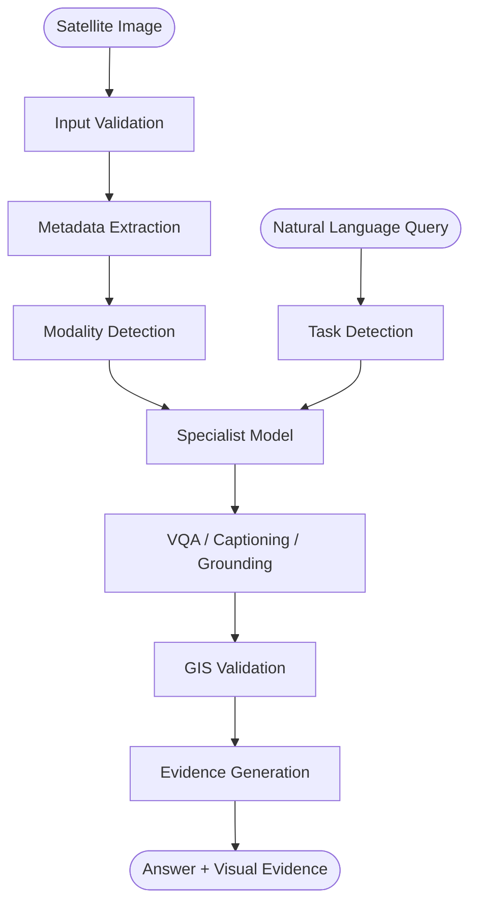

**Conceptual Example**

| Step | Detail |
|---|---|
| **Input** | `satellite.tif` |
| **Question** | *"What objects are visible near the road?"* |
| **Flow** | GeoTIFF validates → Optical imagery detected → Grounding + VQA selected → Object localization → Bounding boxes → Spatial verification → Answer with visual masks |

> No actual model output is shown above. This illustrates the intended data flow.

### B. Bi-Temporal Workflow

Temporal alignment is critical: differences in acquisition date, CRS, spatial resolution, dimensions, and georeferencing can produce false change detections if not handled correctly.

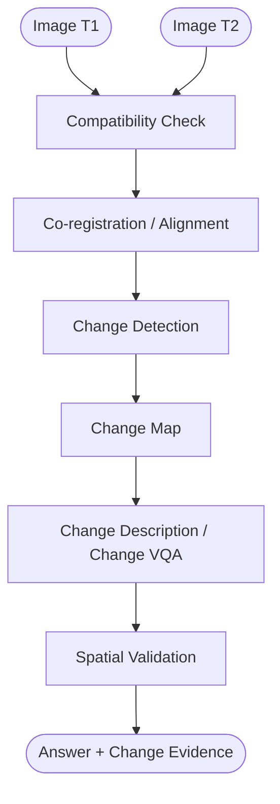

### C. Optical + SAR Workflow

Optical and SAR imagery provide complementary information: optical captures spectral properties; SAR penetrates clouds and captures structural context.

*(Specific fusion architecture is planned for Phase 4.)*

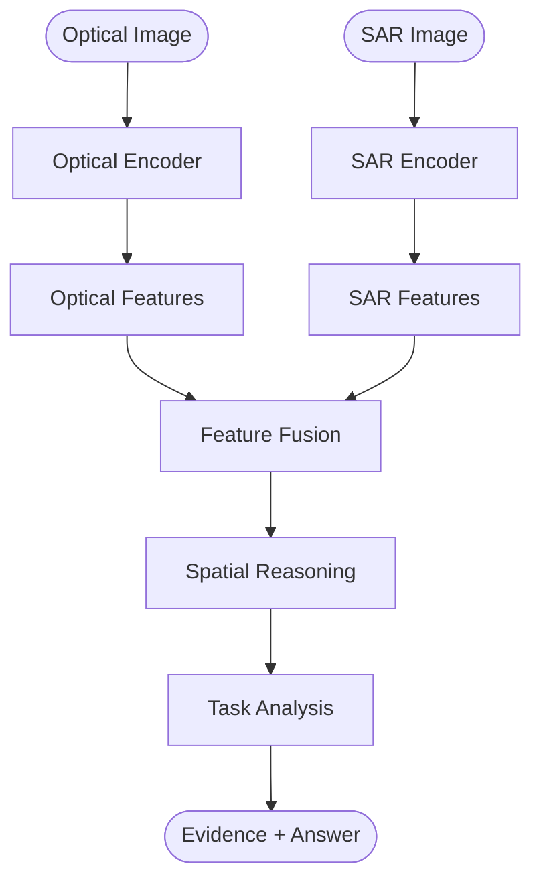

### D. Agentic Orchestration

The orchestrator **does not generate arbitrary code**. It selects from pre-registered, approved models and geospatial tools.

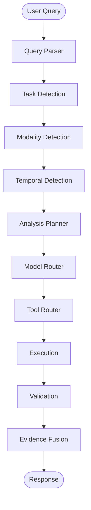

---

## 6. Evidence-First Intelligence

**Interpretation alone is not enough; spatial evidence should accompany the answer wherever the selected task produces spatial outputs.**

The architecture combines:

| Layer | Purpose |
|---|---|
| AI Interpretation | Stochastic model inference |
| Specialist Models | Task-specific, hot-swappable model slots |
| GIS Verification | Deterministic spatial validation of model outputs |
| Visual Evidence | Masks, bounding boxes, map overlays |
| Confidence | Evidence-based assessment (not an arbitrary score) |
| Execution Trace | Auditable record of every processing step |

This design:

*   **Reduces spatial reasoning risks** by pairing model outputs with deterministic GIS checks.
*   **Provides evidence for verification** so users can inspect results, not just trust them.
*   **Exposes uncertainty** rather than hiding it behind a single answer.
*   **Supports auditability** through traceable execution logs.

---

## 7. Supported Inputs

| Input Type | Purpose |
|---|---|
| Optical | Single-image analysis |
| Multispectral | Remote-sensing analysis |
| SAR | SAR-specific analysis |
| Bi-temporal pair | Change analysis |
| Optical + SAR pair | Multimodal fusion analysis |
| GeoTIFF / TIFF | Primary geospatial raster input |
| PNG / JPEG | Only where permitted by prescribed benchmark datasets |

*Supported formats and datasets depend on SIH problem requirements and actual implementation progress.*

**Validation checks**: file type, image count, modality, CRS, metadata, dimensions, georeferencing, temporal compatibility, co-registration.

---

## 8. Technology Stack

| Domain | Current | Future / Optional |
|---|---|---|
| **Frontend** | React 18, TypeScript, Tailwind CSS, Vite | MapLibre GL JS, Next.js App Router |
| **Backend** | Python 3.10+, FastAPI 0.103, Pydantic 2.3, Uvicorn | Celery, Redis |
| **AI / ML** | *(Interfaces defined)* | PyTorch, Hugging Face Transformers, PEFT / LoRA |
| **Geospatial** | *(Interfaces defined)* | GDAL, Rasterio, GeoPandas, Shapely, PyProj |
| **Database** | PostgreSQL 15, PostGIS 3.4 | Object Storage (MinIO) |
| **Infrastructure** | Docker, Docker Compose | Kubernetes, GPU Workers |

*Current backend dependencies: `fastapi==0.103.1`, `uvicorn==0.23.2`, `pydantic==2.3.0`, `pydantic-settings==2.0.3`, `pytest==7.4.2`.*

---

## 9. Repository Structure

```text
satquery-ai/
│
├── frontend/                  # React / Vite web application
│   ├── src/
│   │   ├── app/               # Pages (page.tsx, layout.tsx)
│   │   ├── components/        # UI components (10 implemented)
│   │   ├── hooks/             # Custom React hooks
│   │   ├── lib/               # Utility functions and API clients
│   │   ├── tests/             # Component and integration tests
│   │   └── types/             # TypeScript interfaces
│   ├── Dockerfile
│   └── package.json
│
├── backend/                   # FastAPI server and orchestrator
│   ├── app/
│   │   ├── api/               # Route definitions (7 route modules)
│   │   ├── core/              # Config and settings
│   │   ├── schemas/           # Pydantic models (9 schema files)
│   │   ├── services/          # Business logic
│   │   ├── validators/        # Input validation
│   │   ├── agent/             # Agentic orchestration interfaces
│   │   ├── models/            # ML model interface definitions
│   │   ├── geospatial/        # GIS engine (8 modules)
│   │   ├── db/                # Database connections
│   │   └── utils/             # Helpers
│   ├── tests/                 # Backend tests (3 test files)
│   ├── Dockerfile
│   └── requirements.txt
│
├── ml/                        # ML specialist model directories (planned)
│   ├── vqa/
│   ├── grounding/
│   ├── captioning/
│   ├── change_detection/
│   ├── change_vqa/
│   └── optical_sar/
│
├── geospatial/                # Standalone GIS tools (planned)
├── evaluation/                # Benchmark evaluation scripts (planned)
├── data/                      # Sample datasets and fixtures
├── models/                    # Local model weights / LoRA adapters
├── tests/                     # Top-level integration tests (planned)
├── docs/                      # Architecture and API documentation
│   ├── api/
│   ├── architecture/
│   ├── development/
│   └── research/
├── scripts/                   # Utility and deployment scripts
│
├── docker-compose.yml         # Container orchestration (3 services)
├── .env.example               # Environment variable template
├── .gitignore
├── README.md
└── LICENSE                    # MIT License
```

---

## 10. Backend Architecture

Business logic does **not** live inside route handlers. The backend follows a strict layered pattern:

```text
backend/
└── app/
    ├── api/            # Route definitions only
    ├── core/           # Configuration (settings, constants)
    ├── schemas/        # Pydantic request/response contracts
    ├── services/       # Business logic layer
    ├── validators/     # Input validation logic
    ├── agent/          # Agentic orchestration
    ├── models/         # ML interface definitions
    ├── geospatial/     # GIS engine (registry, raster, alignment, ...)
    ├── db/             # Database session management
    └── utils/          # Shared utilities
```

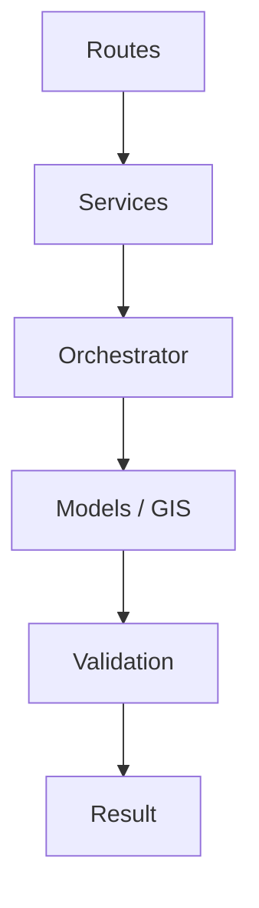

**Geospatial Engine** (`app/geospatial/`): Contains `base.py`, `raster.py`, `registry.py`, `alignment.py`, `geometry.py`, `masks.py`, `projection.py`, `tiling.py`.

**Schemas** (`app/schemas/`): Contains `api.py`, `dataset.py`, `model_schema.py`, `agent_schema.py`, `tool_schema.py`, `analysis.py`, `query.py`, `result.py`, `trace.py`.

---

## 11. Frontend Architecture

```text
frontend/src/
├── app/                # Next.js / Vite pages
│   ├── page.tsx        # Main dashboard
│   ├── layout.tsx      # Root layout
│   ├── analysis/       # Analysis results page
│   └── history/        # Query history page
├── components/         # 10 reusable UI components
├── hooks/              # Custom React hooks
├── lib/                # API clients and utilities
├── tests/              # Component and integration tests
└── types/              # TypeScript type definitions
```

**Implemented Components**:
`QueryBox` · `ImageUploader` · `ImagePreview` · `MapViewer` · `ResultPanel` · `EvidencePanel` · `ConfidenceCard` · `ExecutionTrace` · `AnalysisStatus` · `ModelPipeline`

**User Journey**:

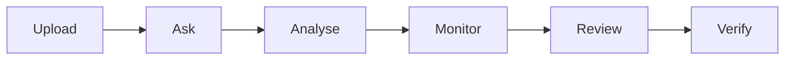

---

## 12. API Architecture

All APIs are versioned under `/api`. Current route prefix: `/api`.

| Endpoint | Method | Purpose | Status |
|---|---|---|---|
| `/api/health` | GET | Service health check | ✅ Implemented |
| `/api/projects` | GET | List projects | ✅ Implemented |
| `/api/datasets` | GET | List datasets | ✅ Implemented |
| `/api/upload` | POST | Upload GeoTIFF / imagery | ✅ Implemented |
| `/api/query` | POST | Submit natural-language query | ✅ Implemented |
| `/api/analysis` | POST | Start analysis job | ✅ Implemented |
| `/api/results` | GET | Retrieve analysis results | ✅ Implemented |

**Conceptual Request / Response Example** *(actual payloads may differ as implementation matures)*:

**POST `/api/analysis`**

```json
// Request
{
  "query": "What changed between these images?",
  "dataset_ids": ["dataset_001", "dataset_002"],
  "options": {}
}
```

```json
// Response
{
  "job_id": "job_9982",
  "status": "queued"
}
```

---

## 13. Analysis Job Lifecycle

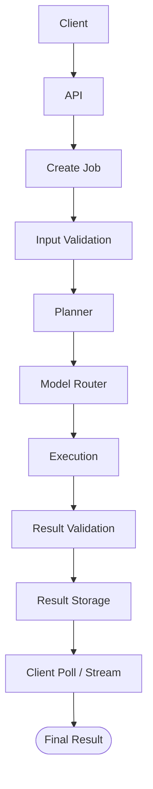

*Future architecture will support asynchronous GPU workloads via a job queue so that long-running inference does not block the API thread.*

---

## 14. Execution Trace

Execution traces support auditability by recording operational events — not internal chain-of-thought reasoning.

**User-Facing Trace Example**:

```text
✓ Input validated
✓ Modality detected (optical)
✓ Task identified (grounding + VQA)
✓ Model selected (Grounding Specialist)
✓ Image processed
✓ GIS validation completed
✓ Evidence generated
✓ Result returned
```

**Conceptual JSON** *(structure subject to change)*:

```json
{
  "trace_id": "tr_001",
  "job_id": "job_9982",
  "events": [
    {"stage": "validation", "status": "success", "detail": "GeoTIFF EPSG:4326 verified"},
    {"stage": "routing",    "status": "success", "detail": "Routed to Grounding Specialist"},
    {"stage": "inference",  "status": "success", "detail": "3 objects localized"},
    {"stage": "gis_check",  "status": "success", "detail": "Bounding boxes within valid extent"}
  ]
}
```

---

## 15. Confidence & Uncertainty

SatQuery AI's confidence architecture is a **design framework** (planned for quantitative evaluation in later phases):

```text
  Model Signal
+ Evidence Quality
+ Spatial Consistency
+ Input Compatibility
+ Cross-Model Agreement
─────────────────────
= Evidence-Based Confidence
```

Confidence is presented as an evidence-based assessment — not an arbitrary probability, and not a guarantee. It communicates the quality and consistency of both spatial and model-generated evidence to the user.

---

## 16. Geospatial Processing

Deterministic GIS operations complement stochastic AI interpretation by grounding model outputs in reliable spatial reality.

| Tool | Role |
|---|---|
| GDAL / Rasterio | Raster I/O, format conversion, band extraction |
| GeoPandas / Shapely | Vector geometry operations |
| PyProj | CRS detection and transformation |
| PostGIS | Spatial database queries and indexing |

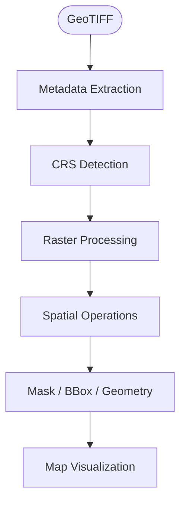

---

## 17. Model Registry

*(Future architecture — not yet populated with trained models.)*

```text
Model Registry
├── VQA Model
├── Grounding Model
├── Captioning Model
├── Change Detection Model
├── Change VQA Model
└── Optical-SAR Fusion Model
```

Each registered model will define: `name`, `version`, `task`, `modality`, `input_type`, `output_type`, `capabilities`, `resource_requirements`, `status`.

Schema foundation: [`model_schema.py`](backend/app/schemas/model_schema.py).

---

## 18. Tool Registry

Agentic execution must use **approved, registered tools** — not arbitrary shell commands.

```text
Tool Registry
├── GDAL
├── Rasterio
├── GeoPandas
├── Shapely
└── PyProj
```

Registry implementation: [`registry.py`](backend/app/geospatial/registry.py).
Schema foundation: [`tool_schema.py`](backend/app/schemas/tool_schema.py).

---

## 19. Local Development Setup

### Prerequisites

*   Git
*   Python 3.10+
*   Node.js (for local frontend development)
*   Docker & Docker Compose

### Quick Start

```bash
# Clone the repository
git clone https://github.com/Siddiquiashrafhussain/SatQuery-AI.git
cd SatQuery-AI

# Copy the environment template
cp .env.example .env

# Start all services (Frontend, Backend, PostgreSQL/PostGIS)
docker compose up --build
```

### Expected Services

| Service | Container | Port |
|---|---|---|
| PostgreSQL + PostGIS | `satquery_db` | 5432 |
| FastAPI Backend | `satquery_backend` | 8000 |
| React Frontend | `satquery_frontend` | 3000 |

### Health-Check Verification

```bash
curl http://localhost:8000/api/health
# Expected: {"status":"ok"}
```

---

## 20. Environment Variables

Defined in [`.env.example`](.env.example):

| Variable | Purpose | Default |
|---|---|---|
| `POSTGRES_USER` | Database user | `postgres` |
| `POSTGRES_PASSWORD` | Database password | `postgres` |
| `POSTGRES_DB` | Database name | `satquery` |
| `ENVIRONMENT` | Runtime environment | `development` |
| `LOG_LEVEL` | Logging verbosity | `info` |
| `BACKEND_PORT` | Backend service port | `8000` |
| `DATABASE_URL` | Full PostGIS connection string | *(composed from above)* |
| `API_BASE_URL` | Backend API base URL | `http://localhost:8000` |
| `STORAGE_PATH` | GeoTIFF / upload storage path | `/app/storage` |
| `MODEL_PATH` | ML model weights directory | `/app/models` |
| `FRONTEND_PORT` | Frontend service port | `3000` |
| `VITE_API_URL` | Frontend → Backend API URL | *(from API_BASE_URL)* |

**Future** (commented out in `.env.example`): `REDIS_URL`, `MINIO_ROOT_USER`, `MINIO_ROOT_PASSWORD`.

> **Warning**: Never commit real secrets to the repository.

---

## 21. Development Workflow

1.  Create a branch: `feature/<name>`, `fix/<name>`, or `docs/<name>`
2.  Develop the feature
3.  Run tests and linting / type checks
4.  Build
5.  Test API endpoints
6.  Commit with a meaningful message
7.  Open a Pull Request for code review

---

## 22. Testing

### Existing Test Suites

| Location | Tests |
|---|---|
| `backend/tests/test_api.py` | API route tests |
| `backend/tests/test_schemas.py` | Pydantic schema validation tests |
| `backend/tests/test_services.py` | Service layer tests |
| `frontend/src/tests/components/` | Component tests |
| `frontend/src/tests/integration/` | Integration tests |

### Planned Test Coverage

*   **ML**: model inference tests, benchmark evaluation
*   **Geospatial**: CRS tests, raster processing tests, geometry tests, alignment tests

*No coverage percentages are claimed, as they have not been measured.*

---

## 23. Evaluation Plan

The following are **planned evaluation dimensions** — not measured results.

| Domain | Metric |
|---|---|
| Single-image VQA | Answer accuracy |
| Captioning | Caption quality metrics (BLEU, CIDEr) |
| Grounding | IoU / mIoU |
| Change detection | IoU, F1, task-appropriate metrics |
| Change VQA | Answer quality |
| Optical-SAR | Task-specific performance |
| Agent routing | Routing accuracy, successful completion, invalid-tool avoidance |
| System | Latency, memory, GPU utilization, failure rate |

> No benchmark numbers are reported because no benchmarks have been run.

---

## 24. Datasets & Research Foundations

The following datasets and research directions **inform** SatQuery AI's design. This does not imply reproduction, ownership, or fine-tuning on these resources.

**Relevant Datasets**: BigEarthNet, VRSBench, RSVQA, CDVQA, SEN1-2.

**Research Directions**: GeoChat, RemoteCLIP, remote-sensing VLMs, remote-sensing mixture-of-experts architectures, change detection, optical-SAR fusion.

---

## 25. SIH26167 Alignment

| Requirement | Status |
|---|---|
| Remote-sensing adaptation | 🏗️ In Progress |
| Single-image VQA | 🚧 Planned |
| Captioning or grounding | 🚧 Planned |
| Bi-temporal change understanding | 🚧 Planned |
| Optical + SAR joint analysis | 🚧 Planned |
| Agentic orchestration | 🚧 Planned |
| Input validation | ✅ Implemented |
| Visual evidence | 🚧 Planned |
| Confidence assessment | 🏗️ In Progress |
| Execution trace | 🏗️ In Progress |
| Web-based interface | ✅ Implemented |
| Downloadable / report outputs | 🚧 Planned |

---

## 26. Development Roadmap

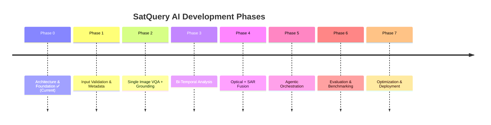

---

## 27. Security

| Practice | Detail |
|---|---|
| File validation | Type, size, and format checks on every upload |
| Path traversal protection | Sanitized file paths |
| Restricted file types | Only permitted image formats accepted |
| No arbitrary code execution | Orchestrator selects from registered tools only |
| Environment-based secrets | All credentials via `.env`, never hardcoded |
| CORS | Configured in FastAPI middleware |
| API validation | Pydantic-enforced request schemas |
| Error sanitization | Internal errors are not exposed to clients |
| Logging | Structured, configurable log levels |

---

## 28. Limitations

*   Model performance depends heavily on training data domain and distribution.
*   Remote-sensing imagery varies by sensor, resolution, and acquisition conditions.
*   Large GeoTIFF processing can require substantial compute and memory.
*   Cloud, haze, and atmospheric effects can significantly degrade optical imagery interpretation.
*   SAR interpretation introduces modality-specific complexity (speckle noise, geometric distortion).
*   Automatic task routing will require extensive evaluation and tuning before production reliability.
*   Spatial outputs still require deterministic validation; model confidence is not a guarantee.
*   Bi-temporal analysis accuracy depends on the quality of co-registration and temporal alignment.

---

## 29. Responsible AI

SatQuery AI is designed as **decision-support tooling**, not an autonomous replacement for domain experts.

| Principle | How it is addressed |
|---|---|
| Evidence-backed outputs | Every answer is paired with spatial evidence where applicable |
| Uncertainty | Confidence is evidence-based, not a hidden score |
| Traceability | Execution traces log every processing step |
| Model / version tracking | Model registry records name, version, and capabilities |
| Human verification | Visual evidence and traces enable expert review |
| No unsupported claims | Architecture separates interpretation from verified spatial facts |
| Reproducibility | Deterministic GIS operations, versioned models, logged traces |

For high-impact applications (disaster response, infrastructure monitoring, environmental compliance), outputs should always be reviewed by qualified domain experts before operational decisions are made.

---

## 30. Performance & Scalability

### Current Architecture

```text
Frontend (React/Vite) → FastAPI Backend → PostgreSQL/PostGIS
```

### Future Scaling Architecture (Planned)

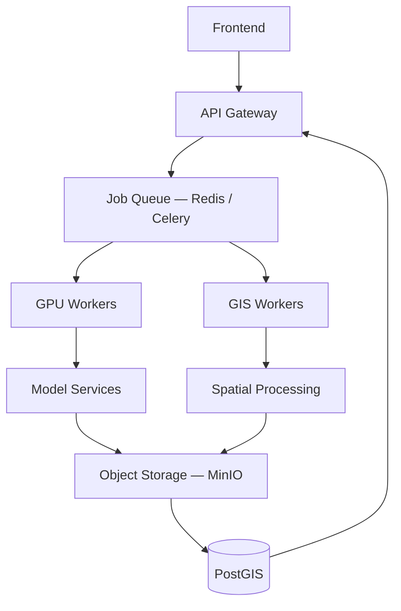

| Component | Purpose | Status |
|---|---|---|
| Redis | Job queue broker | Future |
| Celery | Async task execution | Future |
| GPU Workers | Model inference offloading | Future |
| Object Storage (MinIO) | Large file / result storage | Future |
| Kubernetes | Container orchestration at scale | Future |

*These components are **not** part of the current architecture. Docker Compose placeholders exist in `docker-compose.yml` and `.env.example`.*

---

## 31. Screenshots & Visual Workflow

Screenshots will be placed in `docs/images/` as the UI matures:

```text
docs/images/
├── architecture.png
├── dashboard.png
├── upload.png
├── analysis.png
├── map-evidence.png
└── execution-trace.png
```

<!-- TODO: Add dashboard screenshot when UI is complete -->
<!-- TODO: Add upload flow screenshot -->
<!-- TODO: Add analysis results screenshot -->
<!-- TODO: Add map evidence overlay screenshot -->
<!-- TODO: Add execution trace screenshot -->

---

## 32. Conceptual Result Interface

*(This is a conceptual design of the intended result UI — not yet fully implemented.)*

```text
┌─────────────────────────────────────────────────┐
│  ANSWER                                         │
│                                                 │
│  Natural-language response to the user's query  │
├─────────────────────────────────────────────────┤
│  VISUAL EVIDENCE                                │
│                                                 │
│  Image / Map / Mask / Bounding Boxes            │
├─────────────────────────────────────────────────┤
│  CONFIDENCE                                     │
│                                                 │
│  Evidence-based assessment with breakdown       │
├─────────────────────────────────────────────────┤
│  EXECUTION TRACE                                │
│                                                 │
│  Validation          ✓                          │
│  Model Selection     ✓                          │
│  Analysis            ✓                          │
│  GIS Verification    ✓                          │
└─────────────────────────────────────────────────┘
```

---

## 33. Contributing

1.  Fork the repository
2.  Create a feature branch (`feature/<name>`)
3.  Implement changes
4.  Add or update tests
5.  Update documentation if applicable
6.  Open a Pull Request
7.  Await code review

### Coding Principles

*   **Modularity** — keep ML, GIS, and API layers separated
*   **Type safety** — use Pydantic on Python, strict TypeScript on frontend
*   **Tests** — all new features must include tests
*   **Documentation** — update docs for architectural changes
*   **No fake results** — never hardcode or fabricate model outputs
*   **No secrets** — never commit credentials or API keys
*   **Reproducibility** — deterministic pipelines, versioned dependencies

---

## 34. Code Quality Standards

**Python**:
*   Type hints on all function signatures
*   Pydantic models for all API contracts
*   Clear module boundaries (routes → services → orchestrator)
*   Tests via `pytest`
*   Formatting and linting (to be configured)

**TypeScript**:
*   Strict typing enabled
*   Reusable, focused components
*   Typed API client interfaces
*   Avoid unnecessary `any`

**Git**:
*   Meaningful commit messages
*   Feature branches
*   Reviewed Pull Requests

---

## 35. License

This project is licensed under the **MIT License**. See [`LICENSE`](LICENSE) for details.

Copyright © 2026 Team LIFTOFF.

---

## 36. Team

**Team LIFTOFF** — Smart India Hackathon 2026

<!-- Team member details will be added here when confirmed. -->

---

## 37. References

**Research & Datasets**

*   [GeoChat — Grounded Large Vision-Language Model for Remote Sensing](https://github.com/mbzuai-orber-lab/GeoChat)
*   [VRSBench — A Benchmark for Visual Referring Segmentation in Remote Sensing](https://github.com/lx709/VRSBench)
*   [RSVQA — Visual Question Answering for Remote Sensing](https://rsvqa.sylvainlobry.com/)
*   [CDVQA — Change Detection Visual Question Answering](https://github.com/YZHJessica/CDVQA)
*   [BigEarthNet — Large-Scale Sentinel-2 Benchmark](https://bigearth.net/)
*   [SEN1-2 — Paired SAR-Optical Dataset](https://mediatum.ub.tum.de/1436631)
*   [ISRO Bhuvan](https://bhuvan.nrsc.gov.in/)

**Core Technologies**

*   [FastAPI](https://fastapi.tiangolo.com/)
*   [PyTorch](https://pytorch.org/)
*   [Hugging Face Transformers](https://huggingface.co/docs/transformers)
*   [GDAL](https://gdal.org/)
*   [Rasterio](https://rasterio.readthedocs.io/)
*   [PostGIS](https://postgis.net/)
*   [MapLibre GL JS](https://maplibre.org/)
*   [React](https://react.dev/)
*   [Vite](https://vitejs.dev/)

---

<div align="center">
  <sub>Built for the Smart India Hackathon 2026 by Team LIFTOFF</sub>
</div>
