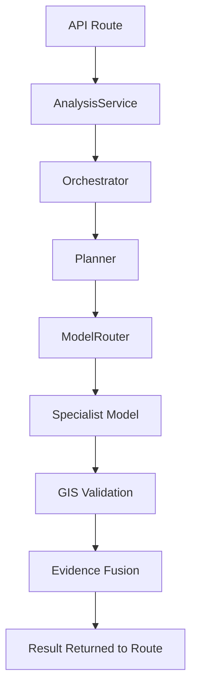

# Backend Design Principles

All development in the SatQuery AI backend must strictly adhere to the following data flow.

## Layered Architecture

Do not bypass layers. The flow of execution must follow this path:

1. **Routes (API)**: Handles HTTP requests, validation (via Pydantic), and returns HTTP responses. No business logic.
2. **Services**: Orchestrates high-level business use cases (e.g., `AnalysisService`).
3. **Domain Logic (Agent)**: The core reasoning loop (`Orchestrator`, `Planner`, `Executor`).
4. **Model / GIS Interfaces**: Abstractions mapping to specific physical models (e.g., `BaseVLM`) or geospatial operations.
5. **Infrastructure**: Database calls, external API calls, object storage.

## Example Execution Chain (Analysis)

When a `POST /api/v1/analysis` request is received, it must traverse the following chain:

**Rule:** A route should NEVER directly import or call a model from the `app.models` directory. All calls must traverse through the `AnalysisService` and the `Orchestrator`.
